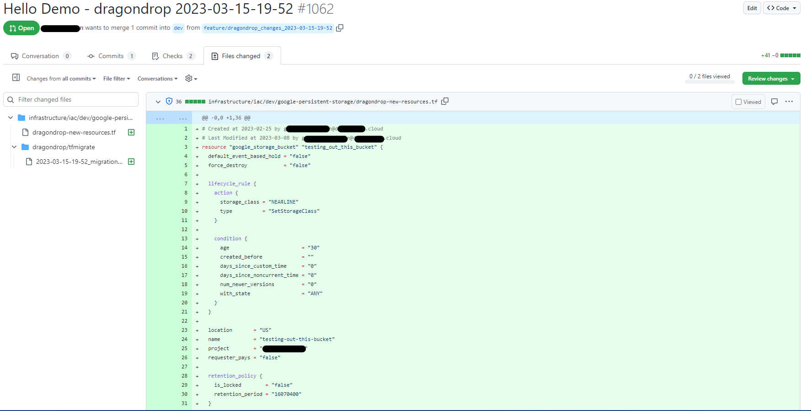
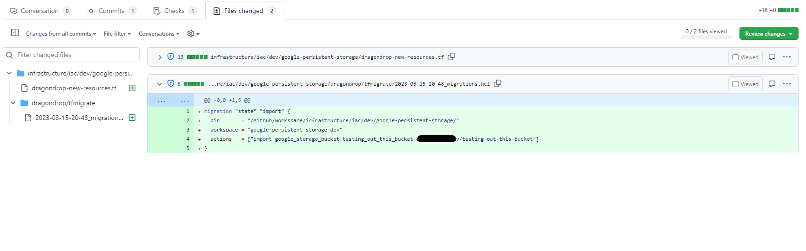
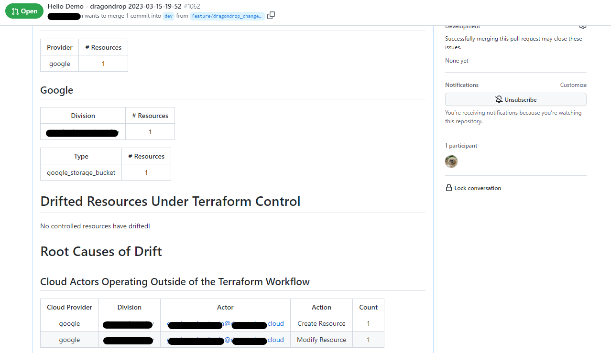

# Pull Request Output

### Example Pull Request Output

We have a live example of cloud-concierge output on GitHub [**here**](https://github.com/dragondrop-cloud/cloud-concierge-example/pull/3).

### New Terraform Code for External Resources

Each identified external resource has Terraform code generated for it and placed into the directory associated with the workspace that dragondrop has identified as most appropriate for the resource. This new Terraform code is generated in a file called "new-resources.tf", allowing you to take the configuration and place it within your organized Terraform files with desired syntax modifications (modules, loops, etc.). At the top of each resource is information on the Cloud Actor who created and most recently modified the resource.

<figure><figcaption>
New Terraform code for external resources, along with the service principals and users that created the resources in the first place.
</figcaption></figure>

### Migration Statements for Importing Resources

If running with Terraform >= 1.5.0, import blocks are generated. Otherwise, identified external resources have a matching state migration statement to import cloud resources generated within the Pull Request.&#x20;

<figure><figcaption>
Automated PR from cloud concierge, example of generated migration statements to import external resources.
</figcaption></figure>

### State of Cloud Report and Cloud Actor Identification

Each Pull Request outputs via a PR comment a "State of Cloud Report" which provides a high level summary of the drifted and new-to-Terraform resources identified by dragondrop. It also outputs a summary of the Cloud Actors that made changes outside of your Terraform workflow, allowing you to close the loop on Terraform drift.

<figure><figcaption>
Surfaced Cloud Actors responsible for changes outside of Terraform control.
</figcaption></figure>

### Drift Within Terraform-Managed Resources

Cleaner than parsing `terraform plan`, each job outputs the specific resource attributes that have drifted for resources that are already managed by Terraform. If this is the only type of drift that your organization would like to identify and surface, that is [configurable within your job](broken-reference).

<figure><figcaption></figcaption></figure>

### Resource Cost Calculations

Within the State of Cloud Report, as well as for individual resources, dragondrop provides detailed cost calculations. Provides users a single pane for their cloud costs (both controlled by Terraform and uncontrolled) within a Pull Request. Cost calculations are powered by a native [Infracost](https://github.com/infracost/infracost) integration.

<figure><figcaption>
Keep all cloud information in one place with cloud cost estimation built into every cloud-concierge execution.
</figcaption></figure>

### Security Risk Surfacing

Identify for all scanned resources, by resource instance, security risks within your cloud.

<figure><figcaption>
cloud-concierge can serve as a single pane for codification, drift detection, cost estimation, and security risk identification.
</figcaption></figure>
